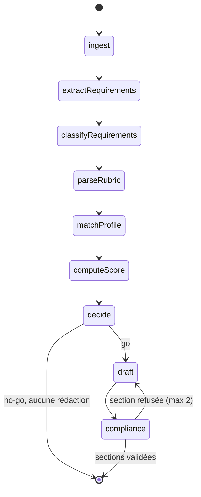

# TenderPilot

Une PME marocaine qui veut répondre à un appel d'offres public doit lire un CPS de
60 à 100 pages, en extraire les exigences, vérifier qu'elle est éligible, et
rédiger un mémoire technique. Trois à cinq jours-homme par dossier. La plupart des
PME ne répondent pas — ou répondent mal et sont écartées sur un vice de forme.

TenderPilot lit le dossier, en extrait chaque exigence **avec sa page source**,
confronte le tout au profil de l'entreprise, rend un **go / no-go argumenté**, et
rédige un brouillon de mémoire technique que l'humain corrige section par section.

L'objectif n'est pas de remplacer le rédacteur, mais de lui livrer un dossier à
80 % dont il ne fait plus que l'arbitrage.

## Démarrage

```bash
cp .env.example .env     # remplir les clés modèle
# déposer le corpus dans apps/api/src/db/seed/data/
npm run up
```

`npm run up` commence par écrire `docker/.env.local`, une fois : un mot de passe
Postgres et un `JWT_SECRET` tirés au sort **pour cette installation**. Le fichier
est gitignoré, Compose le lit après `.env` et le dernier gagne, donc deux machines
ne partagent jamais le même mot de passe de base — et aucune ne reprend celui de
la production. `.env` reste le fichier des clés modèle, et c'est le seul que
`npm run up:vps` lit sur le serveur.

→ interface `http://localhost:4100` · api `http://localhost:4000`
→ compte de démonstration `demo@tenderpilot.local` / `demo1234`

Le worker indexe le corpus de l'entreprise à son démarrage. Pour le relancer à la
main (opération idempotente, elle n'embarque que ce qui ne l'est pas encore) :

```bash
npm run db:index                       # le compte de démonstration
npm run db:index -- vous@exemple.com   # un autre compte
```

Les ports hôte publiés sont des variables (`API_HOST_PORT` 4000, `WEB_HOST_PORT`
4100, `POSTGRES_HOST_PORT` 5433) et ne sont ouverts que sur `127.0.0.1` : le port
conteneur, lui, ne bouge pas (api 3000, web 3100). Sur une machine qui fait déjà
tourner autre chose, changer la variable suffit.

En production les deux moitiés sont séparées : le web est construit et servi par
**Vercel** sur `tenderpilot.ouedghiri.dev`, et le VPS ne fait tourner que
l'api, le worker, postgres et redis derrière nginx sur
`api.tenderpilot.ouedghiri.dev` — vhost versionné dans
[docs/nginx/](docs/nginx/).

```bash
npm run up:vps     # api + worker + postgres + redis, sans le conteneur web
npm run logs:vps
```

Les deux hôtes partagent le domaine `ouedghiri.dev`, donc le cookie de session
reste `SameSite=Lax` : les appels du front vers l'api sont *same-site*. Un front
sur une URL `*.vercel.app` casserait ça.

Postgres ne lit `POSTGRES_PASSWORD` qu'en initialisant un volume vide. Si la
valeur change ensuite — dans `.env`, ou dans un `docker/.env.local` régénéré —
Postgres garde l'ancienne et l'api démarre sur `migrations failed` (`28P01`).
Aligner le rôle, sans toucher aux données :

```bash
docker exec tenderpilot-postgres-1 psql -U tenderpilot -d tenderpilot   -c "ALTER USER tenderpilot WITH PASSWORD '<valeur de .env>'"
```

Détails, variables, mise en production et diagnostic :
**[docs/deployment.md](docs/deployment.md)**.

## Espace de travail web

- `/login` : connexion (redirection par défaut quand la session expire) ; `/signup` : création de compte et accueil
  dans le profil entreprise.
- `/dashboard` : compteurs réels, décisions go / no-go, dossiers récents et
  progression des analyses.
- `/tenders` : recherche, filtres et densité d'affichage ; `/tenders/new` : dépôt
  PDF avec reprise après une erreur d’envoi, sans recréer le dossier dans la même
  session.
- Barre du haut pleine largeur, d'un bord à l'autre de la fenêtre, en trois zones —
  fil d'Ariane, logo au centre, **Nouveau dossier** à droite.
- Sous elle, un rail flottant à gauche : des boutons en icône seule sur `bg-surface`,
  centrés verticalement, le libellé apparaissant au survol. Menu mobile au clavier
  (tiroir avec les libellés), transitions avec mouvement réduit.
- En bas du rail, le compte — icône et nom. Un clic ouvre l'e-mail du compte,
  **Guide de démarrage**, le thème et la déconnexion. Il n'y a plus d'écran
  Paramètres, et le thème n'est plus dans la barre du haut.
- Chaque liste longue — dossiers, documents, références — porte les mêmes deux
  contrôles : des filtres et un choix **normal / compact**, retenu par liste d'une
  visite à l'autre dans le navigateur.
- `/dashboard/controle` : **Contrôle**, la page qui affichera le raisonnement de
  l'IA, les jetons consommés et le temps passé. La trace du graphe ne porte pas
  encore ces mesures, la page dit ce qu'elle attend plutôt que d'inventer un chiffre.
- Vitrine : barre de navigation compacte, liens centrés, sélecteur de langue en
  icône globe avec menu déroulant, et un seul bouton d'action visible, **Connexion**.
- `/company` : import du profil depuis un fichier JSON, **vos références**
  filtrables par secteur, et vos documents de référence filtrables par type.
- `/tenders/[id]` : le bouton **Analyser** au centre, seul. Il devient sur place le
  raisonnement de l'agent, puis se replie en une ligne quand le verdict s'affiche.
  Chaque appel d'outil apparaît **au moment où il rend la main**, avec la phrase
  du modèle expliquant pourquoi il l'a appelé et un résultat construit à partir du
  vrai retour. Les points bloquants, la matrice de conformité et le mémoire
  technique sont trois panneaux latéraux qu'on ouvre quand on veut vérifier.
- **L'agent peut vous poser une question** et suspendre son analyse le temps que
  vous répondiez : une question, ses réponses possibles, et de quoi ajouter une
  consigne, écarter un point bloquant mal jugé ou forcer le verdict. C'est lui qui
  décide quand il en a besoin, trois fois par analyse au maximum. Détail dans
  [docs/agents.md](docs/agents.md).

Les tests navigateur interceptent les appels API : ils vérifient les interactions
frontend, sans créer de comptes ni envoyer de documents au service réel.

```bash
npm run dev:web                     # interface locale :3100
npx vitest run --project web        # tests unitaires frontend
npm run test:e2e                    # vitrine, espace de travail et analyse
npm run test:e2e:workspace -w @tenderpilot/web
npm run test:e2e:smoke -w @tenderpilot/web   # stack réelle et vrai modèle, hors suite
```

Les tests navigateur démarrent une instance isolée sur `127.0.0.1:3101` pour ne
pas tester accidentellement le serveur de développement sur `:3100` ni la pile
Docker sur `:4100`.

Vérification frontend au 19/09/2026 : **22 tests unitaires passent ; 53 tests
navigateur passent, 1 test réservé au mobile est ignoré sur desktop**. Le lint et le
build de production font partie des vérifications de cette interface. Les tests
navigateur utilisent une API simulée et ne constituent pas un test d’intégration du
backend réel.

`e2e/smoke.spec.ts` est le seul à parler à la vraie pile et au vrai modèle : il exige
un `npm run up` démarré et le corpus semé, n'est dans aucune suite par défaut, et
n'affirme que des invariants — un verdict existe, chaque exigence cite une page, la
trace nomme les nœuds qui ont tourné. **Il n'a pas été exécuté ici**, faute de pile
démarrée.

## Une entreprise par compte

Un compte = une entreprise. Créez un second utilisateur et vous obtenez une
application vide : ni profil, ni dossiers, ni documents. Rien n'est partagé, et il
n'y a ni équipe ni invitation — c'est volontaire, l'authentification multi-
utilisateurs est hors périmètre du cahier des charges.

Un nouveau compte commence donc par **Mon entreprise** : importez votre
`profil-entreprise.json`, puis déposez vos attestations et vos mémoires déjà
rendus. Ce sont eux que le rédacteur fouille pour citer une référence réelle — sans
eux, chaque section revient marquée `[A COMPLETER PAR L'HUMAIN]`.

## Déposer un dossier

Les PDF déposés depuis l'interface sont écrits dans `uploads/<utilisateur>/`, sur
un volume Docker nommé — ils survivent à un `npm run up`. Le nom du
fichier stocké est l'empreinte de son contenu, ce qui fait que redéposer le même
PDF ne crée pas de doublon et réutilise le cache d'extraction.

Le fichier est validé sur ses octets (`%PDF`), pas sur l'en-tête annoncé par le
navigateur, et plafonné à `MAX_UPLOAD_MB` (25 Mo par défaut).

On ne sait jamais à l'avance si un PDF déposé est un scan. Chaque page est donc
d'abord lue sans OCR, et **seules celles dont le texte n'est pas exploitable** sont
rastérisées et passées à l'OCR — un dossier de 60 pages avec cinq annexes scannées
coûte cinq pages d'OCR, pas soixante, et ces cinq pages cessent d'être invisibles.
Détail : [docs/pipeline.md](docs/pipeline.md#3-extraction--chaque-page-couche-texte-ou-ocr).

## Ce que ça fait, concrètement

Sur `AO-2026-004`, qui est un **scan intégral sans couche texte** :

```
[ok] ingest               4 pages lues, dont 4 par OCR          34042ms
[ok] extractRequirements  11 exigences extraites                13228ms
[ok] classifyRequirements 8 exigences eliminatoires             10072ms
[ok] parseRubric          grille de notation : 5 criteres        7274ms
[ok] matchProfile         3/11 couvertes par le profil (4 appels d'outil)
                          get_company_facts · search_documents  21990ms
[ok] computeScore         score de couverture : 50/100              1ms
[ok] decide               go - 0 point(s) bloquant(s)               2ms
[ok] draft                4 sections redigees, 7 appels d'outil
                          search_documents · calculate          25920ms
[ok] compliance           4 sections validees, 0 refusees        8785ms
```

Chaque appel d'outil est écrit pour le dirigeant, pas pour nous :

```
Pour vérifier si un de vos CV couvre les 10 ans exigés à l'article 8.
  ↳ recherche « chef de projet certifié PMP » dans vos documents :
    2 passages trouvés (p. 12, p. 4)
  search_documents

Pour vérifier si vous détenez la certification exigée.
  ↳ recherche « certification ISO 22301 » dans vos documents :
    aucun passage ne correspond
  search_documents
```

La phrase du haut est **du modèle** : il remplit un argument `raison` sur l'appel
qu'il faisait déjà, donc ça ne coûte ni appel supplémentaire ni latence. La ligne
`↳` est **construite en code** à partir du résultat réel — le modèle ne raconte
jamais ses propres résultats, c'est comme ça qu'on se retrouve avec « j'ai trouvé
3 références » sous une recherche qui n'a rien trouvé. Le nom technique reste en
dessous, en retrait : le dirigeant l'ignore, un évaluateur y voit qu'un vrai outil
nommé a tourné.

Sur `AO-2026-002`, l'agent rend un **no-go** et dit pourquoi :

> *Le candidat doit être titulaire de la certification ISO 22301:2019.*
> Les certifications détenues sont ISO 9001:2015, ISO 27001:2022 et Qualiopi.

Chaque exigence affichée cite sa page ; un clic ouvre le PDF à cette page.

## Documentation

| Document | Contenu |
|---|---|
| **[docs/agents.md](docs/agents.md)** | **Comment l'agent fonctionne** — le graphe, les outils, les boucles, ce qu'il refuse de faire. Commencez ici |
| [docs/architecture.md](docs/architecture.md) | Les cinq services, les couches, le modèle de données |
| [docs/pipeline.md](docs/pipeline.md) | Le chemin des données : upload, cache, OCR, chunks, embeddings, graphe, export |
| [docs/frontend.md](docs/frontend.md) | Le web : routes, session, TanStack Query, thème |
| [docs/api.md](docs/api.md) | Tous les endpoints, avec exemples de réponses |
| [docs/testing.md](docs/testing.md) | Installation, boucle de développement, lancer et écrire les tests |
| [docs/deployment.md](docs/deployment.md) | Exécution, variables, ports, mise en production derrière nginx, diagnostic |
| [docs/nginx/](docs/nginx/) | Le vhost nginx de l'api, à copier dans `sites-available`, en HTTP simple (certbot ajoute le TLS) |
| [docs/diagrams.md](docs/diagrams.md) | Tous les diagrammes Mermaid : cas d'usage, services, couches, graphe, séquence, extraction, modèle de données |
| [CLAUDE.md](CLAUDE.md) | Règles de code du dépôt |

## Le graphe, en une image



Deux arêtes conditionnelles, et c'est là qu'est l'agent :

- **un no-go ne rédige jamais.** Écrire un mémoire pour un dossier perdu est
  exactement le gaspillage que ce produit évite.
- **une section refusée repart au Writer**, avec des instructions. C'est la boucle
  planifier → appeler des outils → mémoriser → réviser.

Les deux bornes vivent dans la condition d'arête, jamais dans un prompt. On
n'*demande* pas au modèle de s'arrêter, on l'en empêche.

### La ceinture d'outils

Le **Writer** et le **Matcher** reçoivent 9 outils (10 avec `TAVILY_API_KEY`).
Les définitions partent au modèle dans la requête, le modèle choisit ce qu'il
appelle, `LlmService.runToolLoop` exécute et réinjecte les résultats. Les appels
sont les siens, pas une recherche codée en dur :

| | |
|---|---|
| `search_documents` | pgvector, corpus entreprise **ou** dossier |
| `get_company_facts` | profil / références / équipe / marchés passés, filtrables |
| `read_source_page` | texte exact d'une page, avec repli OCR |
| `get_run_state` | étapes, appels, exigences, verdict courant — le « mémoriser » |
| `check_dossier_checklist` | pièces exigées × documents réellement déposés |
| `compute_deadline` · `get_current_date` | arithmétique de dates |
| `calculate` | arithmétique de montants, sans `eval` |
| `simulate_score` | rejoue le verdict sous hypothèse |
| `web_search` | Tavily — **absent si aucune clé** |

`compute_deadline`, `get_current_date` et `calculate` existent parce qu'un modèle
se trompe sur une date ou sur 1,5 % de 2 400 000 **avec assurance**, et qu'un
montant faux dans un mémoire est l'échec le plus visible possible.

Le Matcher en particulier : chaque `unknown` qu'il produit devient un point
bloquant, donc un `unknown` qu'un appel d'outil aurait levé est une faute, pas de
la prudence. Détail et arbitrages dans [docs/agents.md](docs/agents.md).

Les autres diagrammes — cas d'usage, services, couches, séquence d'une analyse,
extraction page par page, modèle de données — sont dans
**[docs/diagrams.md](docs/diagrams.md)**, en Mermaid et copiables tels quels.
Comportement de l'agent : [docs/agents.md](docs/agents.md).

## Les garde-fous

- **Ne jamais inventer une référence.** Le Writer ne cite que ce que ses outils ont
  renvoyé. Le Compliance recoupe chaque `REF-xx` / `CV-xx` du texte contre les
  citations **sans appeler de modèle** : une référence fabriquée se détecte sans
  jugement.
- **Admettre une lacune.** Sans élément probant, la section porte
  `[A COMPLETER PAR L'HUMAIN]` et dit ce qui manque.
- **La correction humaine gagne toujours.** Une section réécrite par un humain
  n'est jamais écrasée par un brouillon d'agent, et elle est relue par les
  analyses suivantes du même dossier — pas seulement par le run en cours.
- **Classer les points bloquants par gravité.** Une exigence *prouvée* non
  satisfaite passe avant une exigence *non évaluée*, et le verdict dit lequel des
  deux cas il a sous les yeux plutôt que d'affirmer la même chose des deux.
- **Signaler ce qui n'a pas été lu.** Une page que l'OCR n'a pas pu lire est
  remontée comme illisible, jamais renvoyée comme page vide.
- **Ne pas fabriquer une disqualification.** Seule une *capacité* exigée et absente
  écarte l'entreprise. « Déposer le pli avant le 12/03 » est une tâche de la
  réponse, pas une preuve d'inéligibilité.

## Stack

Next.js 16 + React 19 (TypeScript) · Node 22 + Fastify (JavaScript ESM) ·
LangGraph + checkpointer Postgres · PostgreSQL 16 + pgvector · Redis 7 + BullMQ ·
Zod à chaque frontière · Vitest + Playwright · Docker Compose.

`apps/web` est en TypeScript, `apps/api` en JavaScript : côté api, Zod tient le
rôle du vérificateur de types, à chaque frontière, sans exception.

## Tests

```bash
npm test          # sans réseau ni base de données
```

Aucun test de la suite par défaut n'appelle un fournisseur : `STUB_LLM=1`.

**Dernier passage global documenté au 19/09/2026 : 302 tests passent, 0 échoue**
(29 fichiers). Les 15 échecs précédents venaient de doubles de dépôts antérieurs
au cloisonnement par compte (migration `0004_owner_scoping`) : les tests ont été
remis à la signature réelle, pas contournés. Ce résultat global est distinct des
vérifications frontend ci-dessus. `npm run test:e2e` lance la vitrine et l'espace
de travail avec API simulée. Détail dans [docs/testing.md](docs/testing.md).

### Intégration continue

[`.github/workflows/ci.yml`](.github/workflows/ci.yml) rejoue la même séquence sur
chaque push et chaque pull request : `npm ci`, `npm run lint`, `npm test`,
`npm run test:e2e`, `npm run build`. En cas d'échec le rapport Playwright est
téléversé en artefact.

Le workflow ne déploie rien et **ne lit aucun secret** : le suite de tests pointe
ses URL externes vers un port mort et force `STUB_LLM=1`, et les tests navigateur
interceptent l'api. Le déploiement reste manuel — `npm run up:vps` sur le VPS pour
l'api, l'intégration Git de Vercel pour le web — et ce fichier sert à dire si le
commit qu'ils ramasseraient est vert.
