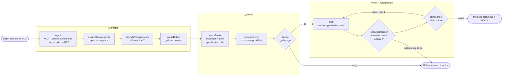
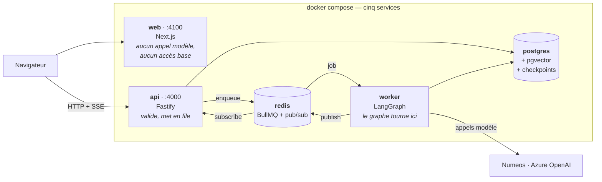

<div align="center">

# TenderPilot — l'appel d'offres lu, jugé et rédigé

**Déposez le CPS, l'agent rend un go / no-go argumenté.** Chaque exigence extraite
**cite sa page source**, chaque outil appelé est visible, et le mémoire technique
reste un brouillon à vérifier. Les 80 % sont un objectif, pas une complétude mesurée.

[Démarrage](#-démarrage) · [Documentation](#-documentation) · [Stack](#-stack) ·
[Structure](#-structure-du-dépôt) · [FAQ](#-faq)

**En ligne :** [tenderpilot.ouedghiri.dev](https://tenderpilot.ouedghiri.dev)

</div>

---

## 🚀 Démarrage

Une machine avec Docker, rien d'autre : le corpus d'exemple est **dans le dépôt**.

```bash
git clone https://github.com/abdel-oue/TenderPilot.git && cd TenderPilot
cp .env.example .env     # remplir LLM_*, AZURE_OPENAI_*, JWT_SECRET
npm run up               # build + migrations + seed
```

→ interface **http://localhost:4100** · api **http://localhost:4000**

Sur l'écran de connexion, **Essayer avec des données d'exemple** ouvre un espace
temporaire sans inscription, pré-rempli avec une copie du jeu de données : deux
visiteurs ne modifient pas les dossiers l'un de l'autre.

```bash
npm run logs             # suivre api + worker
npm run down             # tout arrêter — la base survit (volume nommé)
npm run db:index         # (re)plonger le corpus, idempotent
npm test                 # la suite unitaire, sans réseau ni base
```

Les ports publiés sont des variables (`API_HOST_PORT` 4000, `WEB_HOST_PORT` 4100,
`POSTGRES_HOST_PORT` 5433) et n'écoutent que sur `127.0.0.1`. Le même numéro vaut
dans le conteneur et sur l'hôte.

Variables, diagnostic et cas d'erreur : **[docs/deployment.md](docs/deployment.md)**.
Développer hors conteneur et lancer les tests : **[docs/testing.md](docs/testing.md)**.

### Instance en ligne

| Moitié | Hébergeur | Adresse |
|---|---|---|
| web (Next.js) | Vercel | [tenderpilot.ouedghiri.dev](https://tenderpilot.ouedghiri.dev) |
| api + worker + postgres + redis | VPS, derrière nginx | `api.tenderpilot.ouedghiri.dev` |

Elle ne remplace pas la pile locale : `npm run up` sur un clone propre reste la
voie de référence. [Pourquoi elle existe](docs/faq.md#pourquoi-une-instance-en-ligne-alors-que-le-sujet-ne-demande-que-docker-compose-up-) ·
[comment elle est déployée](docs/deployment.md).

---

## Qu'est-ce que TenderPilot ?

Une PME marocaine qui veut répondre à un appel d'offres public doit lire un CPS de
60 à 100 pages, en extraire les exigences, vérifier qu'elle est éligible et rédiger
un mémoire technique : **trois à cinq jours-homme par dossier**. La plupart ne
répondent pas — ou répondent mal et sont écartées sur un vice de forme.

TenderPilot lit le dossier, confronte chaque exigence au profil de l'entreprise,
rend un verdict argumenté, et ne rédige que si le dossier est jouable.



Dix nœuds LangGraph, **trois arêtes conditionnelles** — et c'est là qu'est l'agent :
un no-go ne rédige jamais, un verdict qui ne tient plus après rédaction est
rebasculé, une section refusée repart au Writer. Les bornes vivent dans la
condition d'arête, jamais dans un prompt : on ne *demande* pas au modèle de
s'arrêter, on l'en empêche.

| | |
|---|---|
| **Scans compris** | chaque page est lue sans OCR d'abord, seules les pages illisibles passent à l'OCR |
| **Traçable** | chaque exigence cite sa page, un clic ouvre le PDF au bon endroit |
| **Agent visible** | chaque appel d'outil apparaît avec la raison donnée par le modèle |
| **Humain dans la boucle** | l'agent suspend l'analyse et vous pose une question quand la règle ne tranche pas |
| **Refuse d'inventer** | sans élément probant, la section porte `[A COMPLETER PAR L'HUMAIN]` |
| **Une entreprise par compte** | rien n'est partagé, ni équipe ni invitation |

→ Une analyse réelle, pas à pas : **[docs/demo.md](docs/demo.md)**

---

## 📚 Documentation

| Doc | Contenu |
|---|---|
| 🎬 [Démonstration](docs/demo.md) | Une analyse de bout en bout, la trace, un no-go argumenté |
| 🤖 [Agent](docs/agents.md) | Le graphe, les outils, les boucles, ce qu'il refuse de faire |
| 🏗️ [Architecture](docs/architecture.md) | Les cinq services, les couches, le modèle de données |
| 🔄 [Pipeline](docs/pipeline.md) | Upload, cache, OCR, chunks, embeddings, graphe, export |
| 🖥️ [Frontend](docs/frontend.md) | Les routes, l'espace de travail, la session, TanStack Query |
| 🔌 [API](docs/api.md) | Tous les endpoints, avec exemples de réponses |
| 🧪 [Tests](docs/testing.md) | Installation, boucle de développement, état de la suite |
| 🚀 [Déploiement](docs/deployment.md) | Variables, ports, mise en production derrière nginx, diagnostic |
| 📐 [Diagrammes](docs/diagrams.md) | Cas d'usage, services, couches, graphe, séquence, données, cycle de vie |
| ❓ [FAQ](docs/faq.md) | Les choix de stack et d'architecture, et pourquoi |
| ⚖️ [Jugement de l'agent](docs/agent-judgement.md) | Deux correctifs appliqués : la lecture des dates, le déclencheur d'`ask_human` |

Annexes : [CLAUDE.md](CLAUDE.md) (règles de code) ·
[apps/web/CLAUDE.md](apps/web/CLAUDE.md) (conventions du web) ·
[apps/web/LANDING.md](apps/web/LANDING.md) (vitrine) ·
[docs/nginx/](docs/nginx/) (vhost de l'api).

---

## 🧰 Stack

| Couche | Technologie | Écart au socle recommandé |
|---|---|---|
| Interface | Next.js 16 + React 19, **TypeScript** | React 18 + Vite recommandé — [pourquoi](docs/faq.md#pourquoi-nextjs-plutôt-quune-spa-react--vite-) |
| API et agents | Node 22 + Fastify, **JavaScript ESM** | TypeScript recommandé — [pourquoi](docs/faq.md#pourquoi-javascript-plutôt-que-typescript-sur-lapi-) |
| Validation | Zod à chaque frontière | tient le rôle du vérificateur de types côté api |
| Orchestration | LangGraph + checkpointer Postgres | conforme |
| Base | PostgreSQL 16 + pgvector, Drizzle | conforme — [pourquoi Drizzle](docs/faq.md#pourquoi-drizzle-et-pas-du-sql-brut-ou-un-orm-complet-) |
| Cache et files | Redis 7 + BullMQ | conforme |
| Modèles | endpoint Numeos (raisonnement) + Azure OpenAI (volume) | les deux fournis, compatibles OpenAI |
| Documents | unpdf (couche texte) + Tesseract (OCR), export `docx` | conforme |
| Tests | Vitest + Playwright | — |
| Exécution | Docker Compose, cinq services | conforme |



Le web n'appelle jamais un modèle et ne touche jamais la base ; l'api ne fait
jamais tourner le graphe. Détail : [docs/architecture.md](docs/architecture.md).

---

## 🧱 Structure du dépôt

```
tenderpilot/
├── apps/
│   ├── web/              # Next.js 16 + React 19, TypeScript     → docs/frontend.md
│   │   ├── app/          # les routes (page.tsx / layout.tsx)
│   │   ├── components/   # l'UI, par domaine
│   │   ├── hooks/        # TanStack Query, un hook par ressource
│   │   └── e2e/          # Playwright
│   └── api/              # Fastify + LangGraph + worker, JS ESM  → docs/architecture.md
│       └── src/
│           ├── routes/ controllers/ services/ repositories/   # les couches
│           ├── graph/    # le StateGraph et ses nœuds          → docs/agents.md
│           ├── agents/   # un agent par fichier, contrats dans schema.js
│           ├── prompts/  # TOUT le texte de prompt, et rien d'autre
│           ├── queue/    # BullMQ : les files et les jobs
│           └── db/       # schéma Drizzle, migrations, seed + corpus
├── packages/shared/      # schémas zod partagés web ↔ api (JavaScript)
├── docker/               # Dockerfile unique, compose, init.sql  → docs/deployment.md
├── docs/                 # la documentation, les diagrammes, le vhost nginx
└── .env.example          # toutes les clés, valeurs vides
```

Les règles qui tiennent cette structure — le SQL uniquement dans les repositories,
les prompts uniquement dans `prompts/`, le nommage `[entité].[rôle].js` — sont dans
[CLAUDE.md](CLAUDE.md).

---

## ❓ FAQ

Les trois questions qui viennent en premier. Les autres — Node 22, Drizzle, les
bornes dans l'arête, l'OCR page par page, la colonne `nature`, sondage + SSE,
l'instance en ligne — sont dans **[docs/faq.md](docs/faq.md)**.

**Pourquoi JavaScript plutôt que TypeScript sur l'api ?**
Sur un hackathon solo de 55 h, le coût du typage statique a un ROI négatif. J'ai
gardé la sécurité en validant aux **entrées** de l'api plutôt qu'à la compilation :
corps HTTP, sortie de modèle, fichier sur disque, variable d'environnement — tout
passe par un schéma zod à la frontière. C'est un meilleur filet là où ce produit
casse vraiment, un modèle qui renvoie un JSON différent de celui qu'il a promis :
TypeScript ne voit rien à l'exécution, `safeParse` le voit, journalise, relance une
fois avec les erreurs réinjectées, puis échoue bruyamment. Le web, lui, est en
TypeScript et tire ses types des mêmes schémas par `z.infer`.
→ [la réponse complète](docs/faq.md#pourquoi-javascript-plutôt-que-typescript-sur-lapi-)

**Pourquoi Next.js plutôt qu'une SPA React + Vite ?**
Le routage, les layouts et le rendu de la vitrine sont donnés : sur 55 h, une heure
de plomberie en moins est une heure de plus sur l'agent, qui pèse 30 % de la note.
L'application reste une SPA authentifiée qui ne fait **aucun appel serveur** vers
l'api — tous les composants de données sont des composants client derrière un
unique `lib/api/client.ts`.
→ [la réponse complète](docs/faq.md#pourquoi-nextjs-plutôt-quune-spa-react--vite-)

**Où est l'agent, et pas simplement un pipeline ?**
Dans les arêtes conditionnelles. Un pipeline exécute ses nœuds dans l'ordre quoi
qu'il arrive ; ici le graphe décide s'il rédige (`decide`), rejuge son verdict une
fois la rédaction faite (`reconcileDecision`), et décide de recommencer une section
qu'il vient d'écrire (`compliance → draft`). S'y ajoutent l'appel d'outils par le
Matcher et le Writer, la mémoire de run, et `ask_human`, qui suspend l'analyse sur
un point de contrôle Postgres jusqu'à votre réponse.
→ [docs/agents.md](docs/agents.md)

---

<div align="center">

> *TenderPilot — le dossier contient déjà la réponse. Encore faut-il l'avoir lu en entier.*

**[Commencer par une analyse réelle →](docs/demo.md)**

</div>
