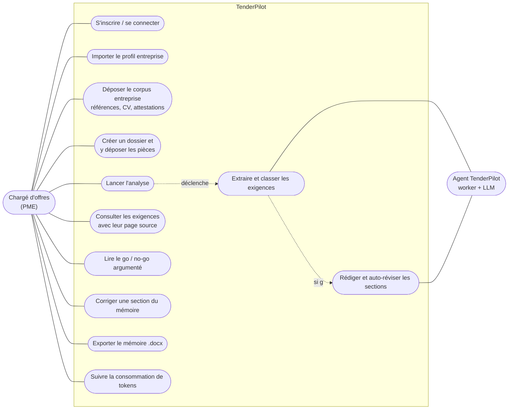
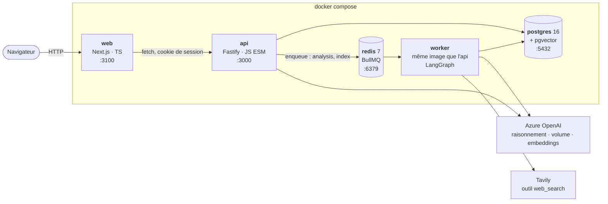
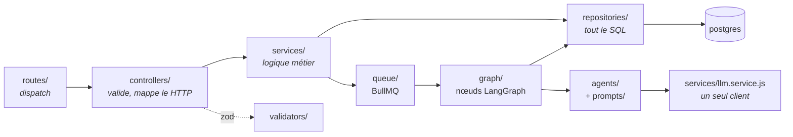
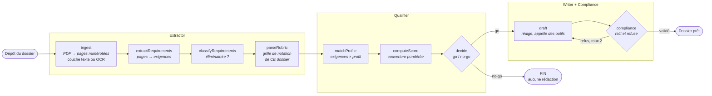
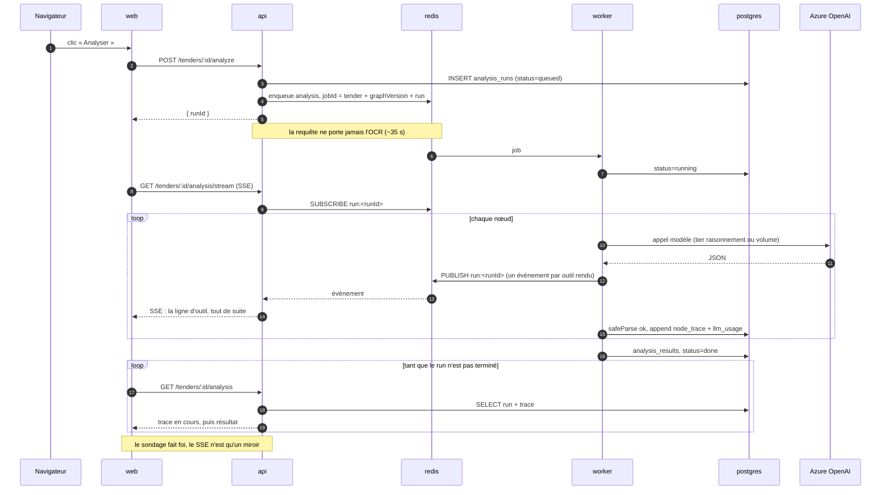
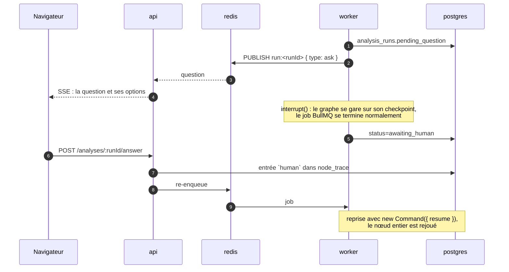
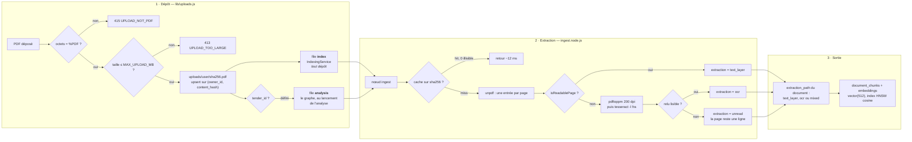
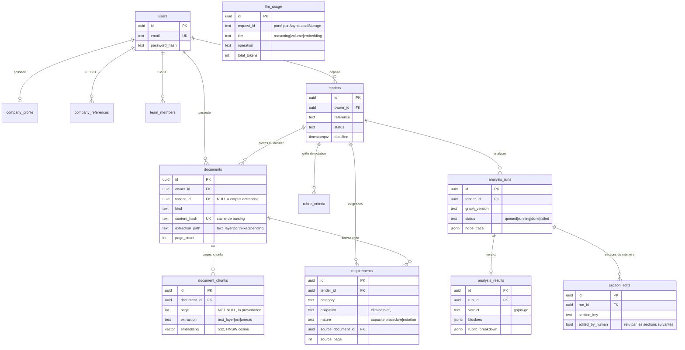
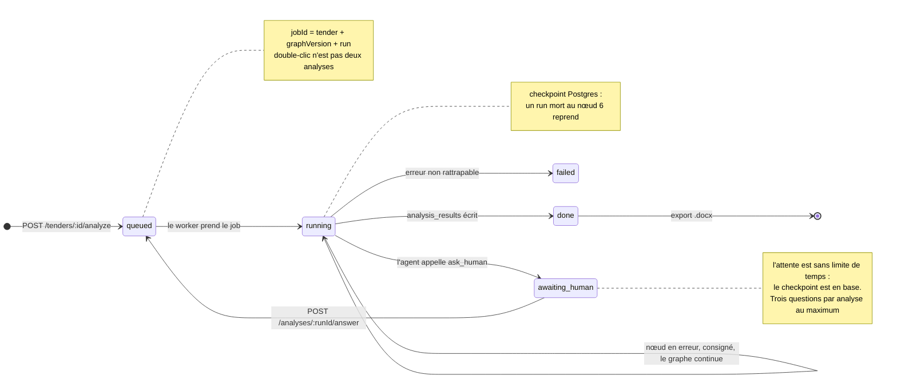

# Diagrammes

Tous les schémas d'architecture du projet, en **Mermaid**. Chaque bloc est
autonome : copiez-le tel quel dans un README GitHub/GitLab, une page Notion, un
ticket, [mermaid.live](https://mermaid.live) (export PNG/SVG), ou un `.md` rendu
par VS Code.

Ils décrivent l'état actuel du code — un changement de graphe, de table ou de
service se répercute ici, comme pour [architecture.md](architecture.md).

| Diagramme | Répond à |
|---|---|
| [Cas d'usage](#1-cas-dusage) | qui fait quoi avec le produit |
| [Services](#2-les-services-vue-conteneurs) | qui parle à qui, sur quel port |
| [Couches api](#3-couches-côté-api) | où atterrit une requête |
| [Graphe de l'agent](#4-le-graphe-de-lagent) | les nœuds et les deux arêtes conditionnelles |
| [Séquence d'une analyse](#5-séquence--lancer-une-analyse) | ce qui est synchrone, ce qui ne l'est pas |
| [Extraction d'un PDF](#6-extraction--décision-par-page) | couche texte, OCR, cache |
| [Modèle de données](#7-modèle-de-données) | les tables et leurs liens |
| [Cycle de vie d'un run](#8-cycle-de-vie-dun-run) | les états d'un `analysis_run` |

---

## 1. Cas d'usage

## 2. Les services (vue conteneurs)

Le `web` n'appelle jamais un modèle et ne touche jamais la base. L'`api` ne fait
jamais tourner le graphe : elle valide, écrit, met en file.

## 3. Couches côté api

Une règle par flèche absente : pas de SQL dans un service, pas de logique dans un
contrôleur, pas de texte de prompt hors de `prompts/`.

## 4. Le graphe de l'agent

Les deux bornes vivent dans la condition d'arête (`shouldDraft`, `shouldRedraft`),
jamais dans un prompt. Détail des nœuds : [agents.md](agents.md).

## 5. Séquence : lancer une analyse

Et si l'agent appelle `ask_human` :

## 6. Extraction : décision par page

## 7. Modèle de données

`llm_usage` n'a pas de clé étrangère : une ligne de consommation doit survivre à
la suppression du dossier qui l'a provoquée.

## 8. Cycle de vie d'un run

